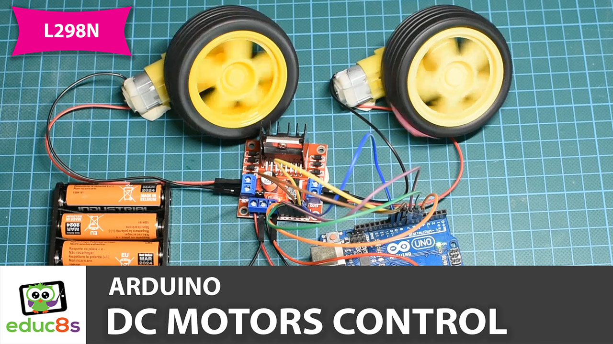
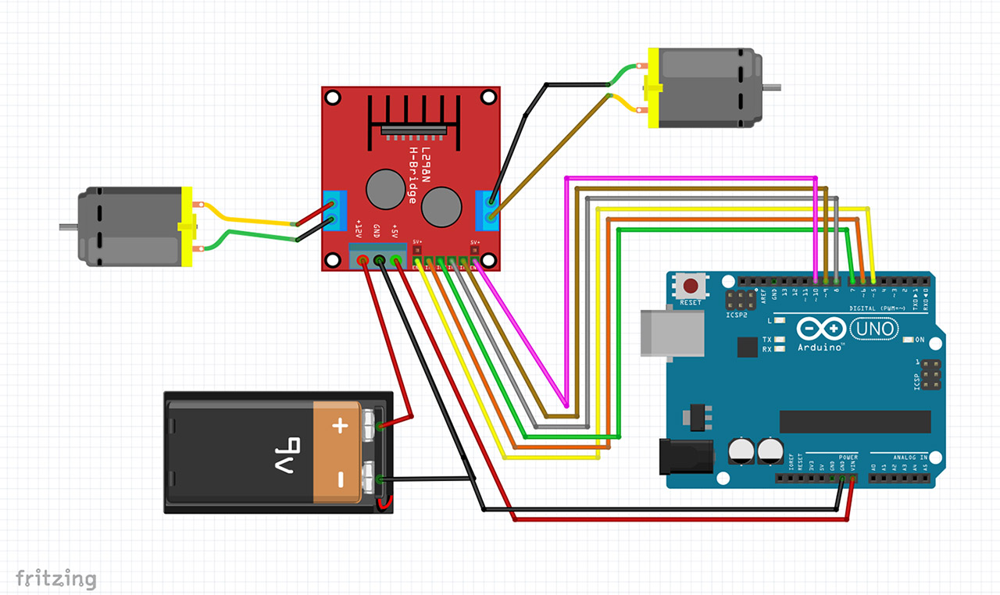

# Arduino-L298N-Motor-Control

These are two simple Sketches to demonstrate how to control two DC motors using Arduino and L298N Board.

  

🎥 <a href="https://www.youtube.com/watch?v=Ey4xoG970Go">Video Tutorial on YouTube</a>

 
 

| 📺 <a href="https://www.youtube.com/educ8s">YouTube</a>
| 🌍 <a href="http://www.educ8s.tv">Website</a> |  

# Parts Needed
🛒 Arduino Uno ▶ http://educ8s.tv/part/ArduinoUno

🛒 ST7789 Display ▶ http://educ8s.tv/part/st7789

🛒 DS18B20 Temperature Sensor ▶ http://educ8s.tv/part/DS18B20

🛒 Breadboard ▶ http://educ8s.tv/part/SmallBreadboard

🛒 Wires ▶ http://educ8s.tv/part/Wires

💖 Full disclosure: All of the links above are affiliate links. I get a small percentage of each sale they generate. Thank you for your support!

# Schematic Diagram

  

